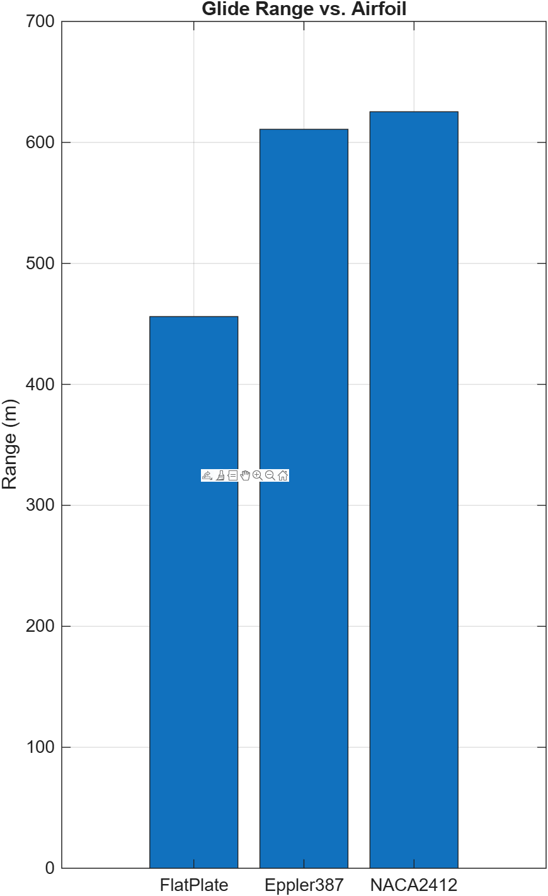

# 2D Glider Simulator

Tested with: MATLAB Online (R2025a)

Goal: Simulate an unpowered glider released from given altitude and compare 
ground distance traveled and glide time across airfoils.

### Model Used

State y = [vx, vy, x, h]^T

#### Forces:

  - L = 0.5 * rho * v^2 * A * CL

  - D = 0.5 * rho * v^2 * A * CD

#### Dynamics:
  
  - v = sqrt(vx^2 + vy^2)

  - dvx/dt = -(D/m) * (vx / v)

  - dvy/dt =  (L/m)   - (D/m) * (vy / v) - g

  - dx/dt  =  vx

  - dh/dt  =  vy

Numerical solver: `ode45` (RK4/5 adaptive step)

Integration is halted when h(t) crosses 0 (i.e., touchdown) 


### Assumptions

- Angle of attack is constant every run, so `CL` and `CD` are too

- `ρ = 1.225kg/m^3` (sea-level)

- Lift + drag are calculated with planform area `A`

- No wind and no variation of density with altitude

- Lift is treated as purely vertical, drag is aligned with velocity vector

### How to run

```matlab
cd src 
main
```
### Outputs

- `plots/` contains figures

- `results/summary.csv` contains summary

- Console table has airfoil, CL, CD, range, flight time


### Constants example

Cessna-172 geometry (m = 1040kg, A = 16.2m^2, g = 9.81m/s^2, ρ = 1.225)

Airfoil presets

| Airfoil    | CL   | CD    |
|------------|-----:|------:|
| FlatPlate  | 0.40 | 0.080 |
| Eppler387  | 0.80 | 0.021 |
| NACA2412   | 0.90 | 0.018 |


- Initial altitude: h0 = 100m

- Initial speed: Vbg = sqrt(2 * m * g/(rho * A * CL))

### Sample Results


| Airfoil    | CL   | CD    | Range (m) | Time (s) |
|------------|-----:|------:|----------:|---------:|
| FlatPlate  | 0.40 | 0.080 |      456.0|     10.8 |
| Eppler387  | 0.80 | 0.021 |      610.8|     18.1 |
| NACA2412   | 0.90 | 0.018 |      625.3|     19.5 |

<h3>Results</h3>
<p>
  
</p>
<p>
  
</p>

We see that from a 100m release height, higher lift-to-drag ratios 
(ex. NACA2412) increase range by around 35% vs. a flat plate. Note 
that measured glide ratio `range/h0` is lower than ideal `CL/CD`; this is since
speed decays during the descent.


License: MIT


